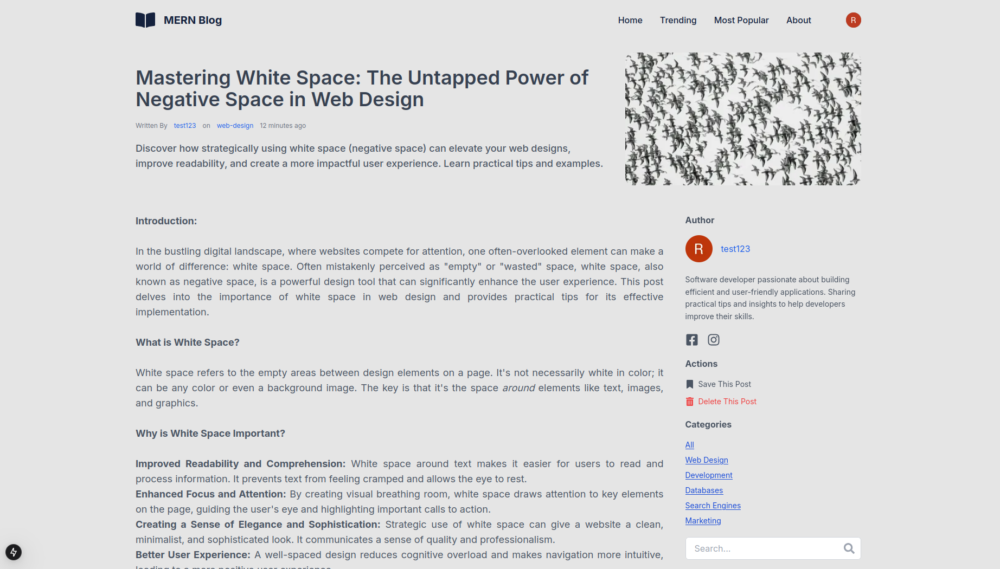
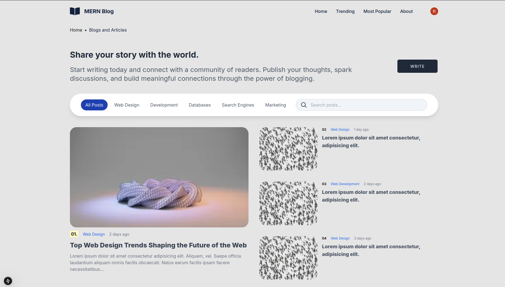
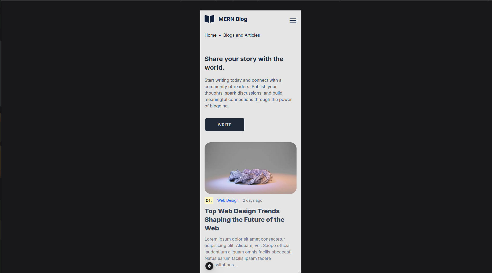
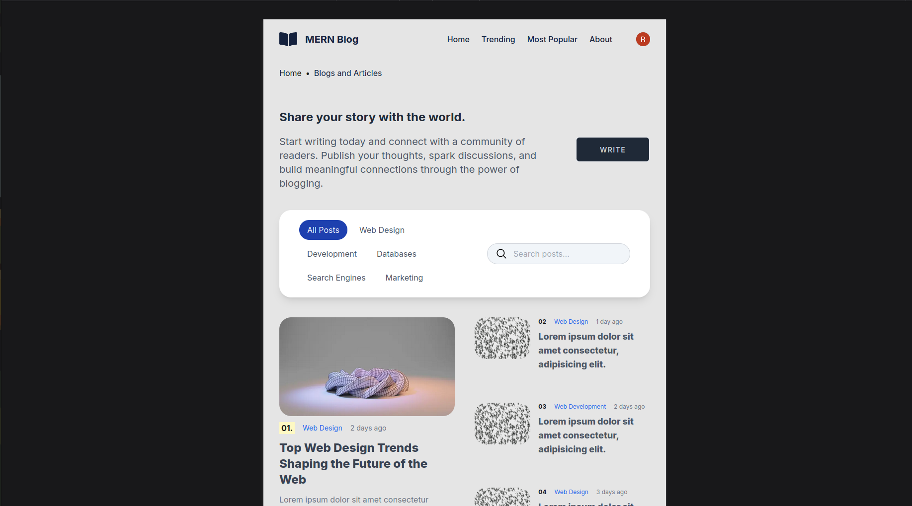
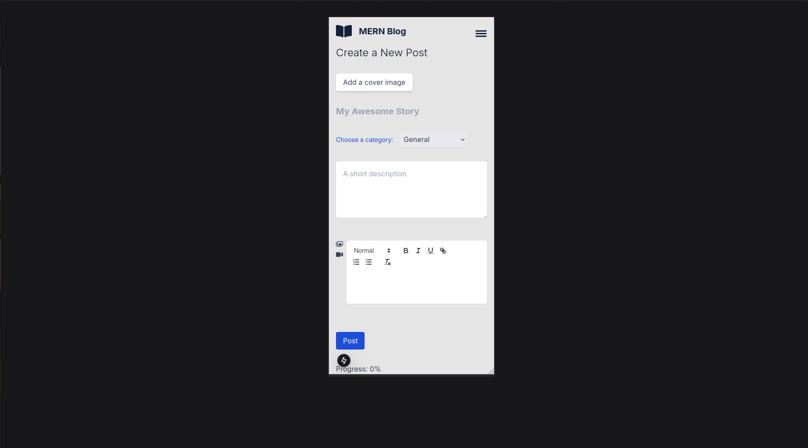
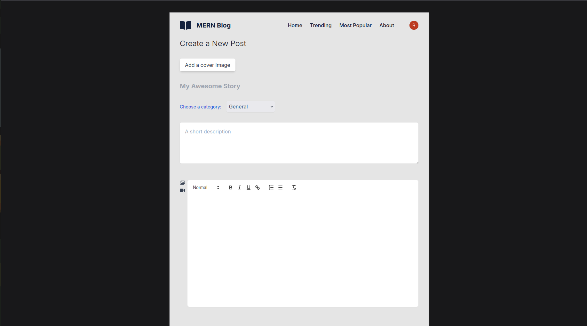
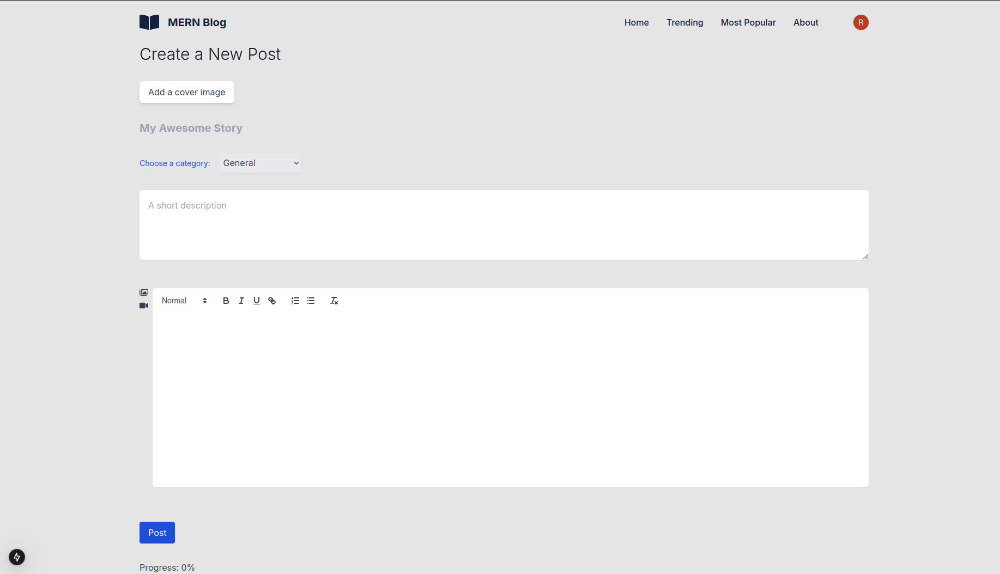

# MERN Blog

## Table of Contents

- [About](#about)
- [Getting Started](#getting_started)

## About <a name = "about"></a>

MERN Blog is a full-stack blogging web application for managing blog posts.
<br><br>








### Main Features

1. Fully-responsive webiste
2. User authentication and authorization (which means users can login, register and logout to and from the platform, they can only delete their own posts)
3. Users can write a blog post with markdown text and insert image, video in their posts
4. Users can delete their own posts
5. Logged-in users can save any post
6. Logged-in users can create comments on any blogpost and can delete their own comments
7. Admin user can delete posts and comments

### TODO Features

1. Search and filter blogposts
2. Increase number of visits for posts as they are being visited
3. Admin user can mark certain posts as featured

## Getting Started <a name = "getting_started"></a>

These instructions will get you a copy of the project up and running on your local machine for development and testing purposes.

### Prerequisites

1. Node.js and npm

```
node -v
npm -v
```

2. Clerk account
3. Imagekit account

### Installing

1. Copy `.env.example` file and rename it `.env`, then, add necessary variables
2. Clone the repository

```
git clone https://github.com/rawdaymohamed/mern-blog
cd mern-blog
```

3. Run the backend

```
cd backend
npm i -f
npm run dev
```

4. Run the frontend

```
cd frontend
npm i -f
npm run dev
```

5. Go to `http://localhost:3000`
